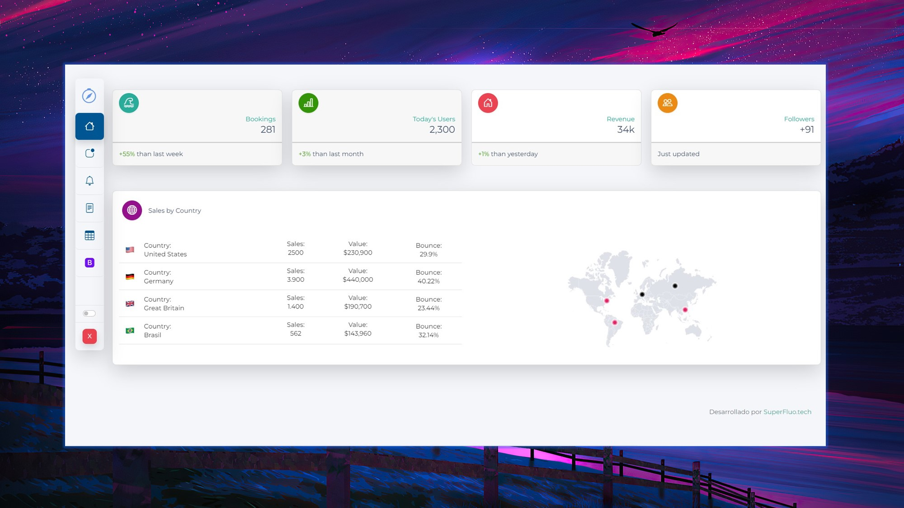
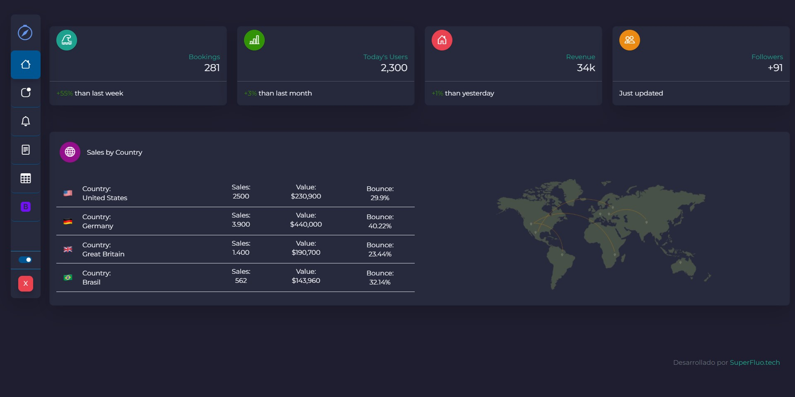
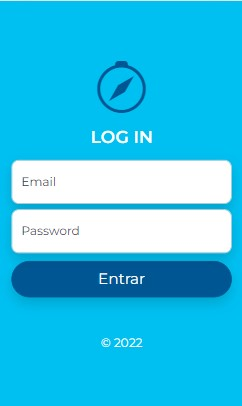

# [Bootlight](http://demo.bootlight.corpjorge.com/)

[Bootlight](https://bootlight.corpjorge.com) is a free Admin, new design inspired by Bootstrap 5.1

Created with the [bootstrap 5.1](https://getbootstrap.com) core so it will allow you to use these components without any inconvenience

## Info

- The repository includes CSS3, HTML5, SASS, typescript and JS files.

## Demo

- see [Demo](https://demo.bootlight.corpjorge.com/)

## Quick start

- `npm i bootlight`
- `yarn add bootlight`
- Clone the repo: `git clone https://github.com/corpjorge/bootlight.git`.
- [Download from Github](https://github.com/corpjorge/bootlight/archive/master.zip).
- [Download from Site](https://www.bootlight.corpjorge.com).

## Dark Mode

- Activate Dark Mode
  

## Responsive design
 
  

## Licensing

- Licensed under MIT (https://github.com/corpjorge/bootlight/blob/master/LICENSE)

